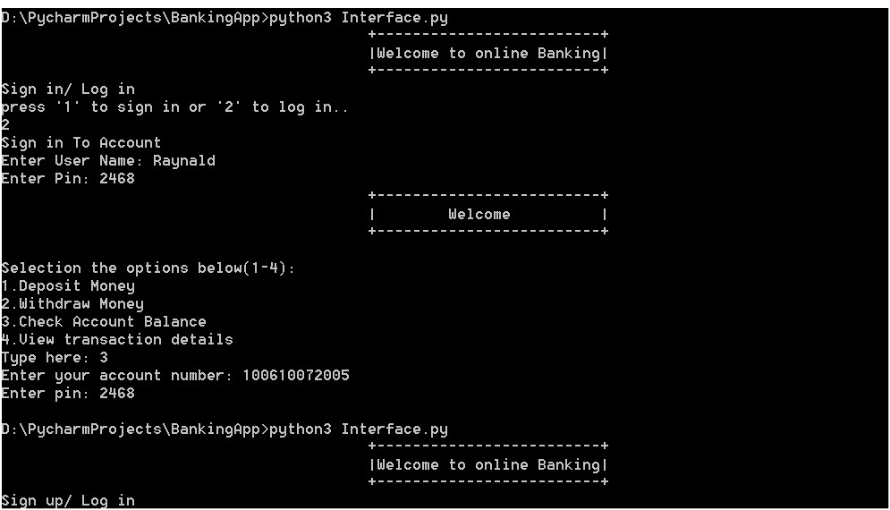

## Basic Command line Banking system using python

 # Interface.py modulo
 1.The interface.py is responsible for the command line interactions
  # The sign_in() 
 The funtion takes in no parameter or kwarg but  returns the user's first_name, second_name, Dob(Date of Birth)
 address and contact.
 3.It also checks if the user will modify any information given before returning or saving the informations
# The Sign_in_proess()
This function is responsible for all the process the new customer goes through when setting up a new
account 
 # Log_in()
 This functions holds all the processes and also allow a customer to perform all the operations on an online 
 banking system platform.

# Main
1.The main function controls the actual command line interface for the program.
2.Checks for user inputs. Whether the user wants to creat and account or login
3.The main function also call the Account_pin_gen function which generateus  a pin and an account number for the 
new user.
4.The function also creates the instance or object for the customer.
This allows the customer to perform all the methods or functions in the BankingSystem

# CustomerInfo.py
The modulo generates the account number of the new user and the account pin
With the help of the random module, it generates fourteen unique numbers for the account 
number and four numbers for the pin and returns them to the main BankingSytem modulo.
With the help of the namedtuple from the collections modulo stored all the values with the 
correct associated keys in a form of a tuple.

# BankingSystem.py
This modulo has the main account class and performs all the possible operations of a bank account.
check the BankingSystem.py to read the comments to understand how the atrributes and methods works.
